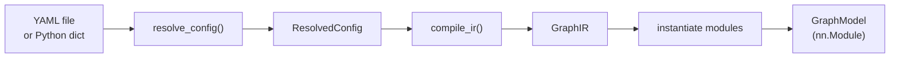
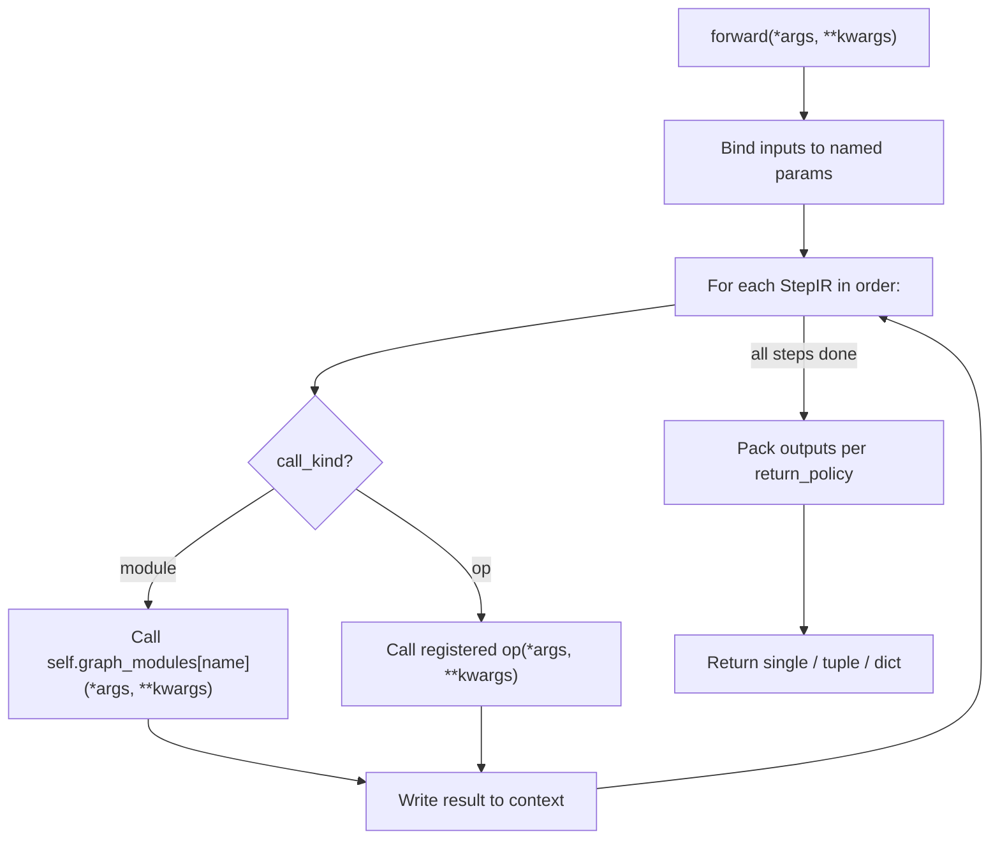

# policy_constructor

YAML-first, construct-only PyTorch model architecture builder.

`policy_constructor` builds `torch.nn.Module` architectures from `.yaml` files and intentionally **does not** include any training or inference engine logic. It is designed to be embedded as a git submodule inside training and inference codebases.

The Python package is `model_constructor`; all imports use:

```python
from model_constructor import build_model
```

## What this repo is (and is not)

**Is**

- A YAML-first architecture playground — swap blocks and hyperparameters in YAML without touching training code.
- Architecture/input/output agnostic — models are graphs of modules and ops; your parent repo decides the task.
- Submodule-friendly — embed it into a training repo or an inference engine without coupling.
- Deterministic — the same YAML always produces the same `nn.Module` graph (no side effects).

**Is not**

- A trainer, dataset loader, optimizer config system, checkpointing framework, metrics runner, or inference server.

## Features

- **Two model frontends**: `model.sequential` (linear pipeline) and `model.graph` (explicit DAG with skip connections, weight sharing, and op calls)
- **YAML composition**: `defaults` includes, `_merge_` list directives, `_template_` expansion, `${...}` interpolation with typed env vars
- **Type-safe registry**: module factories referenced by `_type_` key with signature validation (`strict`, `best_effort`, `runtime_only`)
- **Built-in torch.nn modules**: `nn.Linear`, `nn.Conv2d`, `nn.LayerNorm`, `nn.ReLU`, `nn.GELU`, `nn.SiLU`, `nn.Dropout`, `nn.Flatten`, and more (see [model_constructor/registry/builtins.py](model_constructor/registry/builtins.py))
- **Built-in runtime ops**: `add`, `mul`, `cat`, `stack`, `getitem`, `identity`
- **Experimental blocks**: vision backbones (RadioV3, DepthAnything3), flow matching policies (CFG-VQVAE, VFP, naive), mutual information estimators, OpenPI integration (see [model_constructor/blocks/register.py](model_constructor/blocks/register.py))
- **Reusable basic block classes**: MLP, ConvBnAct, ResidualBlock, TransformerEncoder, TransformerDecoder — available as Python classes for use in custom blocks (see [model_constructor/blocks/basic_blocks/](model_constructor/blocks/basic_blocks/))
- **Plugin system**: parent repos register custom blocks via YAML `imports` + `register(registry)` without forking
- **Rich error context**: config path, source file/line/col, include stack, and typo suggestions via `difflib`
- **DAG-only enforcement**: forward references and cycles are caught at compile time

## Installation

### Requirements

- Python >= 3.10
- PyTorch >= 2.2

The PyTorch version is enforced at runtime by [`model_constructor/compat.py`](model_constructor/compat.py).

### Option A: Add as a git submodule (recommended)

```bash
git submodule add <this-repo-url> third_party/policy_constructor
```

Pin the submodule commit in your parent repo for reproducibility.

Then add the submodule root to Python's import path:

```bash
export PYTHONPATH="$PWD/third_party/policy_constructor:$PYTHONPATH"
```

Or in Python:

```python
import sys
from pathlib import Path

sys.path.insert(0, str(Path(__file__).resolve().parents[1] / "third_party" / "policy_constructor"))

from model_constructor import build_model
```

### Option B: Clone and use directly

```bash
git clone <this-repo-url>
cd policy_constructor
pip install torch  # if not already installed
```

There is no `pip install` for `policy_constructor` itself — it is a pure import-path package. Ensure the repo root is on `PYTHONPATH` or `sys.path`.

### Optional extras

Experimental blocks may require additional dependencies depending on which blocks you use:

- **OpenPI integration** (`openpi_batched`): requires `safetensors`, `jax` (CPU)
- **Vision backbones** (`radiov3`, `da3`): may require `timm` or backbone-specific dependencies

## Quickstart

### Minimal example: build from a Python dict

```python
import torch
from model_constructor import build_model

# Build a model from an inline config
model = build_model({
    "schema_version": 1,
    "model": {
        "sequential": {
            "layers": [{"_type_": "nn.Identity"}],
        },
    },
})

x = torch.randn(2, 3)      # (batch=2, features=3)
y = model(x)                # y.shape == torch.Size([2, 3])
print(type(model).__name__)  # GraphModel
print(y.shape)               # torch.Size([2, 3])
```

### Graph model with skip connection and op

```python
import torch
from model_constructor import build_model

model = build_model({
    "schema_version": 1,
    "model": {
        "graph": {
            "inputs": ["x"],
            "modules": {"m": {"_type_": "nn.Identity"}},
            "nodes": [
                {"name": "h1", "call": "module:m", "args": ["$x"]},
                {"name": "h2", "call": "op:add", "args": ["$h1", "$h1"]},
            ],
            "outputs": ["$h2"],
            "return": "single",
        },
    },
})

x = torch.randn(2, 3)
y = model(x)
# y == x + x
print(y.shape)  # torch.Size([2, 3])
```

### Build from a YAML file

Create `my_model.yaml`:

```yaml
schema_version: 1
model:
  graph:
    inputs: [x]
    modules:
      proj: {_type_: nn.Linear, in_features: 64, out_features: 32}
      act: {_type_: nn.ReLU}
    nodes:
      - {name: h1, call: module:proj, args: [$x]}
      - {name: h2, call: module:act, args: [$h1]}
    outputs: [$h2]
    return: single
```

```python
import torch
from model_constructor import build_model

model = build_model("my_model.yaml")
x = torch.randn(4, 64)       # (batch=4, in_features=64)
y = model(x)
print(y.shape)                # torch.Size([4, 32])
```

### Return policies

The `return` key controls how outputs are returned:

| Policy | Outputs | Python return type |
|--------|---------|-------------------|
| `single` | 1 name | `Tensor` |
| `tuple` | N names | `tuple[Tensor, ...]` |
| `dict` | mapping | `dict[str, Tensor]` |

If `return` is omitted, it is inferred: one output → `single`, multiple → `tuple`, mapping → `dict`.

## Repository layout

```
policy_constructor/
├── README.md                           # This file
├── pyproject.toml                      # Project metadata (Python >=3.10, pytest config)
├── model_constructor/                  # Main Python package
│   ├── __init__.py                     # Public API: build_model, compile_ir, resolve_config, Registry
│   ├── api.py                          # Build pipeline orchestration
│   ├── compat.py                       # PyTorch version check (>= 2.2)
│   ├── errors.py                       # Error hierarchy (ConfigError, GraphExecutionError, etc.)
│   ├── config/                         # YAML resolution pipeline
│   ├── graph/                          # GraphIR compiler and GraphModel executor
│   ├── registry/                       # Module/op registry
│   ├── instantiate/                    # Spec-to-object instantiation engine
│   ├── blocks/                         # Built-in blocks and experimental components
│   └── util/                           # Plugin import mechanism
├── configs/                            # Example YAML configs
│   ├── examples/                       # Simple demos (sequential_mlp, graph_skip_add)
│   └── experiments/                    # Complex experimental configs
├── examples/                           # Runnable example scripts
│   ├── build_and_run.py                # Minimal build + forward pass
│   └── end_to_end.md                   # Two-repo submodule workflow
└── tests/                              # pytest test suite
```

Each subdirectory under `model_constructor/` has its own README with detailed documentation. Start with:

- [model_constructor/README.md](model_constructor/README.md) — internal architecture and extension tutorials
- [model_constructor/config/schema_v1.md](model_constructor/config/schema_v1.md) — normative YAML contract
- [model_constructor/config/authoring_yaml.md](model_constructor/config/authoring_yaml.md) — practical YAML authoring guide

## Concepts and architecture

### Build pipeline

The canonical entry point is `build_model()` in [`model_constructor/api.py`](model_constructor/api.py), which chains all stages:

```
YAML file or dict
  → resolve_config()       config/resolve.py
  → ResolvedConfig
  → apply_imports()        util/imports.py
  → compile_ir()           graph/compiler.py
  → GraphIR
  → instantiate modules    instantiate/instantiate.py
  → GraphModel             graph/model.py  (torch.nn.Module)
```



**Stage details:**

1. **Resolve config** ([`model_constructor/config/resolve.py`](model_constructor/config/resolve.py))
   - Parse YAML with source location tracking
   - Resolve `defaults` includes (file-based composition, cycle-checked)
   - Apply `_merge_` list directives (`append`, `prepend`, `replace`, `keyed`)
   - Expand `_template_` references (deep merge, cycle-checked)
   - Interpolate `${...}` expressions (config paths, env vars, typed env vars)
   - Validate against schema v1

2. **Apply imports** ([`model_constructor/util/imports.py`](model_constructor/util/imports.py))
   - Load modules listed in `imports: [...]`
   - Call `register(registry)` in each imported module to register custom blocks

3. **Compile to GraphIR** ([`model_constructor/graph/compiler.py`](model_constructor/graph/compiler.py))
   - Supports `model.sequential` and `model.graph` frontends
   - Produces `GraphIR`: named modules + ordered execution steps + outputs
   - Enforces DAG-only constraint (no forward references, no cycles)

4. **Instantiate modules** ([`model_constructor/instantiate/instantiate.py`](model_constructor/instantiate/instantiate.py))
   - Converts each module spec (`_type_` or `_target_`) into a `torch.nn.Module`
   - Validates kwargs against constructor signatures per the entry's signature policy
   - Recursively instantiates nested specs

5. **Return GraphModel** ([`model_constructor/graph/model.py`](model_constructor/graph/model.py))
   - `GraphModel` is a `torch.nn.Module` subclass
   - `.forward()` binds inputs → executes steps → packs outputs per return policy
   - Module calls use `ModuleDict` for proper parameter tracking

The normative semantic contract is documented in [`model_constructor/config/schema_v1.md`](model_constructor/config/schema_v1.md).

### Key abstractions

| Abstraction | File | Purpose |
|-------------|------|---------|
| `build_model()` | [`api.py`](model_constructor/api.py) | Main entry point: YAML → `nn.Module` |
| `compile_ir()` | [`api.py`](model_constructor/api.py) | YAML → `GraphIR` (no instantiation) |
| `resolve_config()` | [`api.py`](model_constructor/api.py) | YAML → `ResolvedConfig` (resolution only) |
| `Registry` | [`registry/registry.py`](model_constructor/registry/registry.py) | Module/op registration with signature policies |
| `GraphIR` | [`graph/ir.py`](model_constructor/graph/ir.py) | Intermediate representation: modules + steps + outputs |
| `GraphModel` | [`graph/model.py`](model_constructor/graph/model.py) | Runtime executor (`torch.nn.Module`) |
| `ResolvedConfig` | [`config/resolve.py`](model_constructor/config/resolve.py) | Resolved config with source map and settings |
| `Settings` | [`config/settings.py`](model_constructor/config/settings.py) | Global settings (strict, allow_imports, etc.) |

### Data flow at runtime (`GraphModel.forward`)



Runtime references (`$name`) are resolved from a context dict that accumulates inputs and step outputs.

## How to extend

### Add a custom block inside this repo

**Step 1**: Create a new module under `model_constructor/blocks/`:

```python
# model_constructor/blocks/my_block.py
import torch

class MyBlock(torch.nn.Module):
    def __init__(self, *, width: int, dropout: float = 0.0):
        super().__init__()
        self.fc = torch.nn.Linear(width, width)
        self.drop = torch.nn.Dropout(dropout)

    def forward(self, x):
        return self.drop(self.fc(x))
```

**Step 2**: Register it in [`model_constructor/blocks/register.py`](model_constructor/blocks/register.py):

```python
from .my_block import MyBlock
registry.register_module("my_block", MyBlock, signature_policy="strict")
```

**Step 3**: Use it in YAML:

```yaml
schema_version: 1
model:
  sequential:
    layers:
      - _type_: my_block
        width: 128
        dropout: 0.1
```

**Step 4**: Build and verify:

```python
import torch
from model_constructor import build_model

model = build_model("configs/my_model.yaml")
x = torch.randn(2, 128)
y = model(x)
print(y.shape)  # torch.Size([2, 128])
```

### Add blocks from a parent repository (recommended for submodules)

This approach keeps `policy_constructor` unmodified.

**Step 1**: Define a registration module in your parent repo:

```python
# my_project/model_blocks.py
import torch

class TokenMixer(torch.nn.Module):
    def __init__(self, *, width: int, dropout: float = 0.0):
        super().__init__()
        self.net = torch.nn.Sequential(
            torch.nn.Linear(width, width),
            torch.nn.SiLU(),
            torch.nn.Dropout(dropout),
        )

    def forward(self, x):
        return self.net(x)

def register(registry):
    registry.register_module(
        "my_project.token_mixer", TokenMixer,
        signature_policy="strict", tags=("my_project",),
    )
```

**Step 2**: Reference it in your model YAML:

```yaml
schema_version: 1
settings:
  allowed_import_prefixes: ["model_constructor.", "my_project."]
imports:
  - my_project.model_blocks
model:
  sequential:
    layers:
      - _type_: my_project.token_mixer
        width: 128
        dropout: 0.1
```

**Step 3**: Ensure your parent repo's package is importable (`PYTHONPATH` or `sys.path`).

For a full two-repo walkthrough, see [`examples/end_to_end.md`](examples/end_to_end.md).

### Register a custom op

Ops are runtime callables used in `model.graph` via `call: op:<name>`:

```python
def register(registry):
    def my_weighted_add(a, b, alpha=0.5):
        return alpha * a + (1 - alpha) * b

    registry.register_op("weighted_add", my_weighted_add, tags=("custom",))
```

```yaml
nodes:
  - {name: out, call: op:weighted_add, args: [$h1, $h2], kwargs: {alpha: 0.3}}
```

### Extension points summary

| What to extend | Where | Mechanism |
|---------------|-------|-----------|
| Module type | `register.py` or YAML `imports` | `registry.register_module(name, factory)` |
| Runtime op | `register.py` or YAML `imports` | `registry.register_op(name, fn)` |
| YAML features | `defaults`, `_template_`, `_merge_`, `${...}` | Built-in config resolution |
| Graph topology | `model.graph` YAML | DAG of modules and ops |

For detailed extension tutorials, including `model.graph` examples with skip connections and weight sharing, see [`model_constructor/README.md`](model_constructor/README.md).

## Configuration

### Schema v1

Every YAML config requires `schema_version: 1` and a `model` key. The full normative contract is documented in [`model_constructor/config/schema_v1.md`](model_constructor/config/schema_v1.md).

**Top-level keys:**

| Key | Required | Description |
|-----|----------|-------------|
| `schema_version` | Yes | Must be `1` |
| `model` | Yes | Contains `sequential` or `graph` |
| `settings` | No | Override defaults (see below) |
| `defaults` | No | File includes for composition (file path only, not dicts) |
| `imports` | No | Module paths to import for custom block registration |
| `templates` | No | Reusable spec templates (expanded before interpolation) |
| `params` | No | Arbitrary values for interpolation |

### Settings

Defined in [`model_constructor/config/settings.py`](model_constructor/config/settings.py):

| Setting | Default | Description |
|---------|---------|-------------|
| `strict` | `true` | Enforce strict schema and spec validation |
| `allow_imports` | `true` | Enable the `imports` directive |
| `allowed_import_prefixes` | `["model_constructor."]` | Allowed module prefixes for `imports` and `_target_` |
| `allow_target` | `false` | Enable `_target_` import-by-string (expert mode) |
| `error_context_lines` | `2` | Lines of context in error messages |

```yaml
settings:
  strict: true
  allow_imports: true
  allowed_import_prefixes: ["model_constructor.", "my_project."]
  allow_target: false
```

### Interpolation

- **Config reference**: `${params.width}` — type-preserving when used as entire value
- **String embedding**: `"layer_${params.width}"` — stringified
- **Env var (raw)**: `${env:VAR}` — raw string
- **Env var (typed)**: `${env:int:WIDTH,32}` — trimmed, cast, with optional default

### Merge directives

Lists replace by default. To control list merging, wrap in a merge container:

```yaml
imports:
  _merge_: append
  _value_:
    - my_project.model_blocks
```

Modes: `replace` (default), `append`, `prepend`, `keyed`.

### Templates

```yaml
templates:
  linear_block:
    _type_: nn.Linear
    in_features: 64
    out_features: 64

model:
  sequential:
    layers:
      - _template_: linear_block
        out_features: 32       # overrides template value
```

Templates are expanded before interpolation. See [`model_constructor/config/authoring_yaml.md`](model_constructor/config/authoring_yaml.md) for more examples.

### Composition with `defaults`

Supported only when loading from a file path (not in-memory dicts).

`configs/base/backbone.yaml`:
```yaml
schema_version: 1
params: {width: 32}
model:
  sequential:
    layers:
      - {_type_: nn.LazyLinear, out_features: ${params.width}}
```

`configs/experiments/w64.yaml`:
```yaml
defaults: [../base/backbone.yaml]
schema_version: 1
params: {width: 64}
```

## Integration (training / inference repositories)

This repo is intentionally "construct-only". A parent repo owns:
- data loading / preprocessing
- training loops
- checkpoint loading/saving
- inference serving / batching / device placement policies

`model_constructor` only builds a `torch.nn.Module` from YAML.

### Training repo usage

```python
import torch
from model_constructor import build_model

model = build_model("configs/models/my_model.yaml")
optimizer = torch.optim.AdamW(model.parameters(), lr=3e-4)

# your training loop here...
```

### Inference repo usage

```python
import torch
from model_constructor import build_model

model = build_model("configs/models/my_model.yaml")
model.eval()

with torch.no_grad():
    y = model(x)  # your inference code decides how to produce x
```

### Using `defaults` includes in a parent repo

`defaults` resolution is file-path based and uses paths relative to the YAML file, so parent repos typically keep a config tree like:

```
configs/
  base/
  experiments/
  models/
```

Then build via:
```python
model = build_model("configs/experiments/exp_001.yaml")
```

### Reproducibility recommendations

- Prefer `_type_` registry keys over `_target_` imports.
- Keep all registry registrations deterministic (no global side effects).
- Pin:
  - the `policy_constructor` submodule commit
  - your parent repo's registration module code
  - the YAML config used to build the model

## Testing and quality

### Running tests

```bash
# From the repository root
pytest

# Verbose
pytest -v

# Single test file
pytest tests/test_build_and_run.py
```

Test configuration is in [`pyproject.toml`](pyproject.toml):

```toml
[tool.pytest.ini_options]
testpaths = ["tests"]
pythonpath = ["."]
```

### Test coverage

| Test file | What it covers |
|-----------|---------------|
| [`tests/test_build_and_run.py`](tests/test_build_and_run.py) | End-to-end `build_model()` for sequential and graph configs |
| [`tests/test_graph_compiler_contracts.py`](tests/test_graph_compiler_contracts.py) | GraphIR compilation: `order` requirement, forward reference rejection |
| [`tests/test_defaults_and_merge.py`](tests/test_defaults_and_merge.py) | Config `defaults` merging and cycle detection |
| [`tests/test_templates_and_interpolation.py`](tests/test_templates_and_interpolation.py) | `_template_` expansion, `${...}` interpolation, type preservation, typed env vars |

### Code style

The codebase uses:
- Type annotations throughout (Python 3.10+ syntax with `from __future__ import annotations`)
- `dataclass(frozen=True)` for immutable data structures
- Keyword-only arguments (`*`) for block constructors
- No external linting/formatting config detected — follow existing patterns

## Troubleshooting

### `ModuleNotFoundError: No module named 'model_constructor'`

The submodule root is not on `PYTHONPATH` or `sys.path`.

**Fix**: Add the repo root to the path:
```bash
export PYTHONPATH="$PWD/third_party/policy_constructor:$PYTHONPATH"
```

### `CompatibilityError: Unsupported torch version`

PyTorch version is below the minimum (2.2). The check is in [`model_constructor/compat.py`](model_constructor/compat.py).

**Fix**: Upgrade PyTorch:
```bash
pip install --upgrade torch
```

### `ConfigError: Unknown module type '...'`

The `_type_` key references a registry entry that doesn't exist.

**Fix**:
- Check for typos (the error includes suggestions via `difflib`)
- Ensure your custom block registration runs (via YAML `imports` or parent-code registration)
- List available types:
  ```python
  from model_constructor.registry.default_registry import get_default_registry
  print(get_default_registry().list_modules())
  ```

### `ConfigError: Unknown op '...'`

An `op:<name>` reference in a graph step is not registered.

**Fix**: Use a built-in op (`add`, `mul`, `cat`, `stack`, `getitem`, `identity`) or register a custom op.

### `ConfigError: Forward reference(s) not allowed`

A graph node references a `$name` that hasn't been produced yet. Graph execution is DAG-only.

**Fix**: Reorder nodes so producers come before consumers, or move recurrence inside a block module.

### `ConfigError: nodes mapping form requires 'order: [..]'`

When `model.graph.nodes` is a mapping (dict), `order` is required for deterministic execution.

**Fix**: Add `order: [name1, name2, ...]`, or switch to the list form for `nodes`.

### `ConfigError: imports are disabled` / `import ... is not allowed`

The `imports` directive is turned off or the module prefix is not allowed.

**Fix**: Enable imports and allow your prefix:
```yaml
settings:
  allow_imports: true
  allowed_import_prefixes: ["model_constructor.", "my_project."]
```

### `ConfigError: _target_ is disabled by settings.allow_target`

`_target_` import-by-string is disabled by default for safety.

**Fix**: Prefer `_type_` registry keys. If you must use `_target_`, enable it:
```yaml
settings:
  allow_target: true
  allowed_import_prefixes: ["model_constructor.", "torch."]
```

### `ConfigError: defaults include cycle detected`

Two or more YAML files include each other in a cycle via `defaults`.

**Fix**: Restructure your config hierarchy to eliminate circular includes.

### `GraphExecutionError: Missing required input '...'`

The model expects named inputs that were not provided in the `forward()` call.

**Fix**: Check the `inputs` list in your YAML config and pass all required tensors:
```python
# If inputs: [x, y]
model(x_tensor, y_tensor)
# or
model(x=x_tensor, y=y_tensor)
```

### Shape mismatches at runtime

Modules are standard `torch.nn.Module`s — shape constraints come from the individual blocks, not from the graph system. Use `null` (None) for lazy layers (`nn.LazyLinear`, `nn.LazyConv2d`) to defer input size inference.

## Contributing

### Development setup

```bash
git clone <this-repo-url>
cd policy_constructor
pip install torch   # >= 2.2
pytest              # verify tests pass
```

### Style guidelines

- Follow existing code patterns (type annotations, `from __future__ import annotations`, keyword-only args for block constructors)
- Use `dataclass(frozen=True)` for immutable data structures
- Register new blocks in [`model_constructor/blocks/register.py`](model_constructor/blocks/register.py) with appropriate `signature_policy` and `tags`
- All user-facing errors should use the error types from [`model_constructor/errors.py`](model_constructor/errors.py) with `config_path` and `location` when available
- Keep blocks as pure `torch.nn.Module` subclasses — no training logic, no dataset assumptions

### PR checklist

- [ ] All existing tests pass (`pytest`)
- [ ] New blocks are registered with `signature_policy="strict"` and descriptive `tags`
- [ ] YAML examples are valid schema v1
- [ ] Error messages include config path and source location where possible
- [ ] No training, inference, or dataset logic added to the constructor

## Documentation map

**Start here for navigation**: [`docs/INDEX.md`](docs/INDEX.md) — single hub that routes you to the right doc by what you're trying to do.

If you prefer a linear reading order:

1. **First hour, copy-paste path** — [`docs/QUICKSTART.md`](docs/QUICKSTART.md)
2. **How to think about this repo** — [`docs/MENTAL_MODEL.md`](docs/MENTAL_MODEL.md)
3. **What every term means** — [`docs/GLOSSARY.md`](docs/GLOSSARY.md)
4. **When something breaks** — [`docs/TROUBLESHOOTING.md`](docs/TROUBLESHOOTING.md) (or the "Troubleshooting" section above)
5. **Normative YAML contract** — [`model_constructor/config/schema_v1.md`](model_constructor/config/schema_v1.md)
6. **Practical YAML authoring** — [`model_constructor/config/authoring_yaml.md`](model_constructor/config/authoring_yaml.md)
7. **Two-repo submodule workflow** — [`examples/end_to_end.md`](examples/end_to_end.md)
8. **Internal architecture & extension tutorials** — [`model_constructor/README.md`](model_constructor/README.md)

**Component docs (near the code)**
- [`model_constructor/blocks/README.md`](model_constructor/blocks/README.md) — custom-block extension points
- [`model_constructor/blocks/basic_blocks/README.md`](model_constructor/blocks/basic_blocks/README.md) — reusable `nn.Module` primitives
- [`model_constructor/blocks/experiments/README.md`](model_constructor/blocks/experiments/README.md) — experimental policy components and registry keys
- [`model_constructor/config/README.md`](model_constructor/config/README.md) — YAML resolution pipeline overview
- [`model_constructor/graph/README.md`](model_constructor/graph/README.md) — GraphIR and GraphModel
- [`model_constructor/instantiate/README.md`](model_constructor/instantiate/README.md) — spec-to-object engine
- [`model_constructor/registry/README.md`](model_constructor/registry/README.md) — module/op registry
- [`model_constructor/util/README.md`](model_constructor/util/README.md) — plugin imports mechanism
- [`configs/README.md`](configs/README.md) — example configs walkthrough
- [`tests/README.md`](tests/README.md) — test suite and how to add tests

## License

No LICENSE file is present at the repository root. Third-party components under `model_constructor/blocks/experiments/backbones/vision/externals/` include their own license files.
