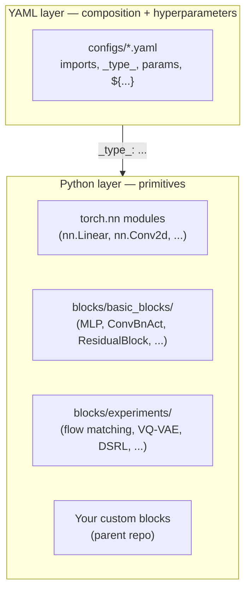
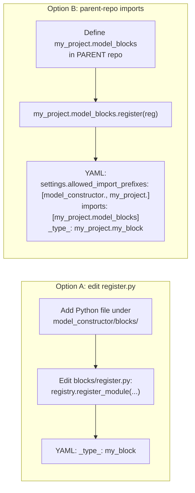
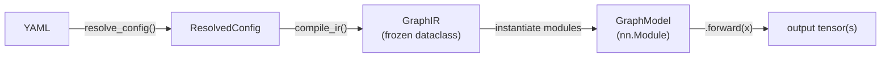
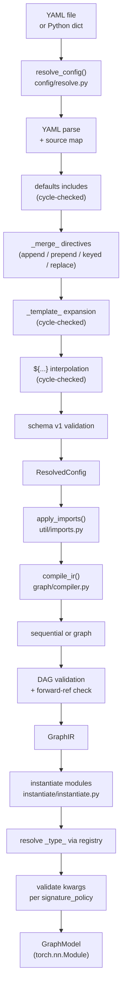

# Mental Model — How to Think About This Repo

This document is the conceptual map. If a senior engineer were walking you through the codebase at a whiteboard, this is roughly what they would draw. Read this **once**, end-to-end, before going deeper into the component READMEs — it will save you several confused hours.

If a term is unfamiliar, see [GLOSSARY.md](GLOSSARY.md).

## Contents

- [Why this repo exists](#why-this-repo-exists)
- [The two layers](#the-two-layers)
- [The two YAML frontends](#the-two-yaml-frontends)
- [Modules vs ops](#modules-vs-ops)
- [`_type_` vs `_target_`: why `_type_` is the default](#_type_-vs-_target_-why-_type_-is-the-default)
- [Signature policies — strict, best_effort, runtime_only](#signature-policies--strict-best_effort-runtime_only)
- [DAG-only — why forward references are forbidden](#dag-only--why-forward-references-are-forbidden)
- [Lazy modules and the `null` trick](#lazy-modules-and-the-null-trick)
- [Weight sharing — call the same module twice](#weight-sharing--call-the-same-module-twice)
- [The two extension points](#the-two-extension-points)
- [`GraphIR` vs `GraphModel` — data vs executor](#graphir-vs-graphmodel--data-vs-executor)
- [The role of `Settings`](#the-role-of-settings)
- [Putting it together — the build pipeline, refined](#putting-it-together--the-build-pipeline-refined)
- [Open questions for the maintainer](#open-questions-for-the-maintainer)

---

## Why this repo exists

`policy_constructor` is a **YAML-first, construct-only** PyTorch model builder. "Construct-only" means: it knows how to assemble a `torch.nn.Module` from a YAML file, and nothing else.

It deliberately **does not include**:

- a training loop
- a dataset / dataloader
- an optimizer config system
- a checkpoint format
- a metrics runner
- an inference server / batching policy
- device-placement logic

Those concerns belong to a **parent repository** that vendors this one as a git submodule. The same parent repo (or two — one for training, one for inference) shares one YAML file and one block-registration module, and gets a bit-identical `torch.nn.Module` from either side.

If you find yourself adding training-loop code, dataset loaders, or `torch.save`/`load_state_dict` plumbing to this repository, stop and put it in the parent repo instead.

---

## The two layers

Everything in this codebase falls cleanly into one of two layers:



**YAML layer** controls:

- Which primitives are used (`_type_: nn.Linear`, `_type_: cfg_vqvae_action_decoder`, etc.).
- Their hyperparameters (`out_features: 32`, `dropout: 0.1`, etc.).
- How they're wired together (sequential stack vs DAG; skip connections; weight sharing).
- Per-experiment overrides (via `defaults`, `${env:int:WIDTH,32}`, etc.).

**Python layer** contains:

- The built-in `torch.nn` modules (always available).
- Reusable primitives in [`model_constructor/blocks/basic_blocks/`](../model_constructor/blocks/basic_blocks/) (e.g., `MLP`, `ConvBnAct`, `TransformerEncoder`).
- Experimental research blocks in [`model_constructor/blocks/experiments/`](../model_constructor/blocks/experiments/).
- Your custom blocks (defined in the parent repo).

The split is useful because **architecture experiments rarely require new primitives** — they're almost always recompositions of existing primitives with different hyperparameters. Putting composition in YAML means you can run an experiment by editing one config file, never touching Python.

---

## The two YAML frontends

`build_model()` accepts a YAML that describes the model under `model:` using one of two shapes:

### `model.sequential` — a linear pipeline

For straight stacks. Internally compiles to a `GraphIR` where each layer feeds the next, in order.

```yaml
model:
  sequential:
    layers:
      - {_type_: nn.Flatten}
      - {_type_: nn.Linear, in_features: 784, out_features: 256}
      - {_type_: nn.ReLU}
      - {_type_: nn.Linear, in_features: 256, out_features: 10}
```

Constraints:

- Exactly one input.
- Outputs default to the last layer's output.
- No skip connections, no weight sharing, no ops.

If your model fits in `model.sequential`, prefer it — fewer moving parts.

### `model.graph` — an explicit DAG

For everything else: skip connections, multi-input/multi-output, branching, weight sharing, calls to ops.

```yaml
model:
  graph:
    inputs: [x]
    modules:
      proj: {_type_: nn.Linear, in_features: 64, out_features: 32}
      act:  {_type_: nn.ReLU}
    nodes:
      - {name: h1, call: module:proj, args: [$x]}
      - {name: h2, call: module:act,  args: [$h1]}
    outputs: [$h2]
    return: single
```

Key idea: you declare named **modules** once, then write **nodes** that call them in order. A node can call a `module:<name>` or an `op:<name>` (a pure function registered in the op registry). Nodes reference each other by name via `$h1`-style **runtime references**. See [GLOSSARY.md](GLOSSARY.md#runtime-reference) for the full syntax.

### When to pick which

- **`sequential`** — linear stack, one input, no branching. Done.
- **`graph`** — anything else. Skip connections, multiple inputs (the CFG-VQVAE policy in [`configs/experiments/cfg_vqvae_flow_matching.yaml`](../configs/experiments/cfg_vqvae_flow_matching.yaml) takes 5 inputs: `cond_proprio`, `cond_visual`, `action`, `time`, `noise`). Mixing of `op:` calls with `module:` calls. Weight sharing (call the same `module:<name>` twice).

Almost every non-trivial policy in this repo uses `model.graph`.

---

## Modules vs ops

Both are registered into the same `Registry`, but they are different things:

| Aspect | Module (`register_module`) | Op (`register_op`) |
|---|---|---|
| Returns | a `torch.nn.Module` instance | the bare callable itself |
| Holds parameters? | **Yes** — `nn.Parameter`s tracked by autograd | **No** — pure function |
| Called from YAML as | `_type_: <name>` in `modules:` + `call: module:<name>` | `call: op:<name>` |
| Instantiated when | at build time, once | not instantiated; called every forward pass |
| Examples | `nn.Linear`, `MLP`, `cfg_vqvae_action_decoder` | `add`, `mul`, `cat`, `stack` |

**Rule of thumb**: if the thing has weights, it's a module. If it's a pure function (or stateless wrapper around a torch function), it's an op.

`operator.add` is registered as an op. `nn.Linear(64, 32)` is registered as a module factory. The difference matters because PyTorch needs to see your modules in the module tree (via `ModuleDict`) to register their parameters for optimization. Ops are never in the module tree.

---

## `_type_` vs `_target_`: why `_type_` is the default

Two ways to point a YAML spec at a Python callable:

- `_type_: my_block` — **registry lookup**. The string `"my_block"` must be a registered key. Used 99% of the time. Discoverable (`registry.list_modules()`), typo-checked (suggests close matches), reproducible.
- `_target_: my_project.path.MyClass` — **import-by-string**. Imports the dotted module path and grabs the attribute. Off by default. Enabled with `settings.allow_target: true`. Also requires the prefix to be in `settings.allowed_import_prefixes`.

`_target_` is off by default for two reasons:

1. **Safety** — it imports arbitrary code at build time. The prefix allowlist limits the blast radius.
2. **Reproducibility** — registry keys are stable identifiers under your control; module attribute paths can drift across refactors.

Use `_type_` unless you have a specific reason not to. The CFG-VQVAE / VFP / DSRL / ResFit configs all use `_type_` exclusively.

---

## Signature policies — strict, best_effort, runtime_only

When you register a module, you choose how the instantiator should validate kwargs against the constructor's signature ([`instantiate/signature.py`](../model_constructor/instantiate/signature.py)):

- **`strict`** — try to introspect `inspect.signature(target)`. If introspection fails, **raise** (the registration is broken). If it succeeds, reject any unknown kwarg with a `ConfigError`. Use for blocks you control whose signatures are stable.
- **`best_effort`** — introspect if possible; if introspection fails (e.g., C extensions, weird descriptors), silently allow anything. Reject unknown kwargs only when introspection succeeds. This is the default for built-in `nn.*` modules because some have unusual signatures.
- **`runtime_only`** — never pre-validate. Pass kwargs straight through; if the constructor rejects them, you'll see the underlying `TypeError` wrapped as `ConfigError`. Use for ops (default) and for blocks whose signatures you don't want validated up-front (rare).

Concrete rule: blocks introduced in this repo's [`blocks/register.py`](../model_constructor/blocks/register.py) are all registered with `signature_policy="strict"`. Built-in torch modules are `best_effort`. Ops default to `runtime_only`.

If your block has a `**kwargs` catch-all, signature validation silently passes (it can't tell which kwargs are accepted). Some templates in [`blocks/experiments/templates/`](../model_constructor/blocks/experiments/templates/) use `**kwargs` to propagate to the abstract base class — concrete subclasses still want a real keyword list for catching typos.

---

## DAG-only — why forward references are forbidden

`GraphIR` (the compiled internal representation, [`graph/ir.py`](../model_constructor/graph/ir.py)) is a **DAG**. Every `$name` reference in a node must point to a model input or to a value produced by an *earlier* node. This is checked in [`graph/compiler.py`](../model_constructor/graph/compiler.py) `_validate_ir()` (~line 292): if it can't find a producer for a referenced name in the already-seen set, you get `ConfigError: Forward reference(s) not allowed`.

The constraint comes from the executor: [`graph/model.py`](../model_constructor/graph/model.py) walks `self._steps` in order, accumulating outputs into a context dict (~line 35). A reference to a not-yet-produced value would simply be missing from the context — by enforcing DAG order at compile time, we surface this as a clear config error instead of a vague runtime failure.

**Where forward references naturally arise — and what to do instead:**

- **Recurrence** (e.g., RNN-style "output of step t feeds into step t+1"): wrap the loop **inside a custom block module**. The graph calls the block once; the loop lives in the block's `.forward()`.
- **Iterative refinement** (e.g., diffusion sampling): same answer — keep the iteration inside a module.
- **Cycles for skip connections that "skip backward"**: usually these can be reordered. If they truly can't, the layer-pair lives inside one wrapper module.

So: `GraphIR` describes the **single forward pass topology**, not the training loop. Loops belong in Python code.

---

## Lazy modules and the `null` trick

Several built-in torch modules (`nn.LazyLinear`, `nn.LazyConv2d`) support **deferred parameter initialization**: the first forward pass sees the input's shape and only then creates the weight matrix. In YAML, you signal this with `null`:

```yaml
modules:
  stem: {_type_: nn.LazyConv2d, out_channels: 32, kernel_size: 3, padding: 1}
  head: {_type_: nn.LazyLinear, out_features: 10}
```

Constraints and gotchas:

- After the first `model(x)` call, lazy modules are no longer lazy. Their parameters are materialized to match the input shape they saw.
- If you build a model, run it on `x1` of shape `(B, 64)`, then try to run it on `x2` of shape `(B, 128)`, the second call fails — the lazy `Linear` was specialized to 64 features.
- If you rebuild the same YAML twice with different first-forward shapes, you get two **differently-sized** models. This breaks `defaults`/templates-based experiment workflows that assume a fixed architecture per YAML; for those, prefer explicit `in_features` / `in_channels`.

**Recommendation**: use `null` for didactic / playground configs where the input shape is fresh in your head. Use explicit ints for any YAML you check in.

---

## Weight sharing — call the same module twice

If a `model.graph` calls the same `module:<name>` more than once, those calls **share weights**:

```yaml
modules:
  shared_block: {_type_: my_block, width: 128}
nodes:
  - {name: h1, call: module:shared_block, args: [$x]}
  - {name: h2, call: module:shared_block, args: [$h1]}  # SAME weights as the call above
```

If you want two independent blocks, declare them under different names:

```yaml
modules:
  block_a: {_type_: my_block, width: 128}
  block_b: {_type_: my_block, width: 128}
nodes:
  - {name: h1, call: module:block_a, args: [$x]}
  - {name: h2, call: module:block_b, args: [$h1]}  # independent weights
```

Mechanism: the named modules are stored in [`torch.nn.ModuleDict`](https://pytorch.org/docs/stable/generated/torch.nn.ModuleDict.html) inside `GraphModel` ([`graph/model.py`](../model_constructor/graph/model.py) line 25). Each node calls `self.graph_modules[name](...)` — calling the same key twice returns the same module instance.

---

## The two extension points

You can add custom blocks two ways:



### Option A — edit `register.py`

You'll modify [`model_constructor/blocks/register.py`](../model_constructor/blocks/register.py). Pros: simple, one file. Cons: you're now maintaining a fork. Use this when:

- You're experimenting and don't yet care about reproducibility across repos.
- You don't intend to vendor `policy_constructor` as a submodule.

### Option B — parent-repo `imports:` (recommended for submodule usage)

You define your blocks in **your parent repo**, register them with a `register(registry)` function, and tell YAML to import them. Pros: `policy_constructor` stays unmodified across forks; the same YAML works for both training and inference parent repos. Cons: requires the parent module to be on `PYTHONPATH`.

**Failure modes for Option B:**

- Module not on `PYTHONPATH` → `ConfigError: failed to import 'my_project.model_blocks'`. Fix: set `PYTHONPATH`.
- Prefix not allowed → `ConfigError: import 'my_project.model_blocks' is not allowed by settings.allowed_import_prefixes`. Fix: add the prefix to `settings.allowed_import_prefixes` in YAML.
- `register(registry)` not defined → silently no-ops (the import succeeds but nothing happens). Fix: make sure the function is named `register` and exported at module top-level. Reference: [`util/imports.py`](../model_constructor/util/imports.py) line 55.

For a complete walkthrough see [QUICKSTART.md Variant 2](QUICKSTART.md#variant-2--add-a-custom-block-register-it-use-it-from-yaml) and [../examples/end_to_end.md](../examples/end_to_end.md).

---

## `GraphIR` vs `GraphModel` — data vs executor



| | `GraphIR` ([`graph/ir.py`](../model_constructor/graph/ir.py)) | `GraphModel` ([`graph/model.py`](../model_constructor/graph/model.py)) |
|---|---|---|
| What | A frozen dataclass holding the compiled structure: list of inputs, mapping of named module specs, ordered list of `StepIR`s, outputs, return policy. | A `torch.nn.Module` subclass that holds the **instantiated** modules in a `ModuleDict` and executes the steps when you call it. |
| Mutable? | No — `dataclass(frozen=True)`. | Yes (the module parameters change during training). |
| Holds parameters? | No — only specs and references. | Yes — the actual `nn.Module` instances live here. |
| When you'd touch it | If you wanted to inspect or transform the model structure without instantiating (`compile_ir(...)`). | Every time you call `model(x)`. |

Separating the two lets you check the YAML compiles to a valid graph without paying instantiation cost.

---

## The role of `Settings`

`Settings` ([`config/settings.py`](../model_constructor/config/settings.py)) is a frozen dataclass with five flags. Each one affects a different stage:

| Setting | Default | What stage uses it |
|---|---|---|
| `strict` | `true` | Instantiation (rejects unknown `_xxx_` reserved keys in specs) |
| `allow_imports` | `true` | Import stage ([`util/imports.py`](../model_constructor/util/imports.py)) |
| `allowed_import_prefixes` | `("model_constructor.",)` | Both `imports:` and `_target_` import paths |
| `allow_target` | `false` | Instantiation (`_target_` import-by-string) |
| `error_context_lines` | `2` | Error formatting (currently unused by the resolver but reserved) |

You override them in YAML under `settings:`. The parser is in [`config/settings.py`](../model_constructor/config/settings.py) `parse_settings()` (~line 18).

---

## Putting it together — the build pipeline, refined



You almost always call `build_model(path)`, which is just `resolve_config()` + `apply_imports()` + `compile_ir()` + `instantiate` + `GraphModel(...)`. See [`api.py`](../model_constructor/api.py) line 16 for the eight-line implementation.

When something breaks, it broke at one of these stages. [TROUBLESHOOTING.md](TROUBLESHOOTING.md) is organized by which stage produced which error type.

---

## Open questions for the maintainer

While writing these docs, I noticed one discrepancy that's worth flagging:

- The "Built-in blocks" section of [`model_constructor/blocks/README.md`](../model_constructor/blocks/README.md) documents `conv_bn_act`, `mlp`, and `residual_block` as if they're registered, and [`configs/examples/sequential_mlp.yaml`](../configs/examples/sequential_mlp.yaml) and [`configs/examples/graph_skip_add.yaml`](../configs/examples/graph_skip_add.yaml) reference them via `_type_:`. However, [`model_constructor/blocks/register.py`](../model_constructor/blocks/register.py) does **not** register these three types — only the experimental blocks (CFG-VQVAE, VFP, DSRL, ResFit, OpenPI, etc.) and the vision backbones. Calling `build_model()` on either example YAML therefore raises `ConfigError: Unknown module type 'mlp'`.

  The correct entry is in [`basic_blocks/README.md`](../model_constructor/blocks/basic_blocks/README.md), which says explicitly "these are not registered." The blocks-README "Built-in blocks" section is the inconsistency.

  Likely intended fix (for the maintainer): add three `registry.register_module(...)` calls for `MLP`, `ConvBnAct`, and `ResidualBlock` in `register.py`. We have not made this change because the brief forbids editing `.py` files.

  This doc and [QUICKSTART.md](QUICKSTART.md) work around the issue by using only the `nn.*` types in worked examples and by flagging the gap explicitly.
