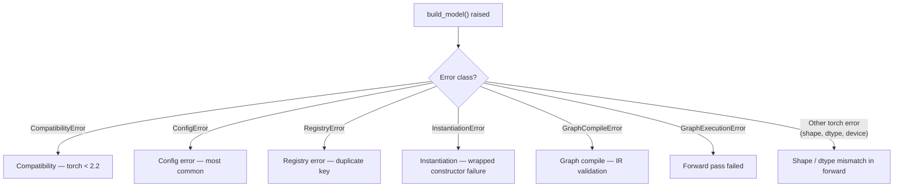

# Troubleshooting

Decision-tree errors guide. Find the error your `build_model()` call printed; follow the link to the fix.

If your error isn't here, search the file for any keyword that appears in the message — error messages in this codebase are intentionally specific (the resolver, compiler, and instantiator each include the `config_path` and source `location` in their messages).

## Contents

- [Before you ask for help — quick checklist](#before-you-ask-for-help--quick-checklist)
- [Error class decision tree](#error-class-decision-tree)
- [`CompatibilityError`](#compatibilityerror)
- [`ConfigError` — most common, organized by message](#configerror--most-common-organized-by-message)
- [`RegistryError`](#registryerror)
- [`GraphExecutionError` — forward pass failed](#graphexecutionerror--forward-pass-failed)
- ["Build succeeded, but the forward pass fails" — debugging recipes](#build-succeeded-but-the-forward-pass-fails--debugging-recipes)
- [When to file a bug](#when-to-file-a-bug)

**Finding a specific error message:** the H2 sections above are categories; each one contains H3 subsections for individual error messages (about 45 in total). Use your browser's or editor's find-in-page (`Ctrl+F` / `Cmd+F`) and paste a unique substring of your error — every message-level subsection's heading matches the error text exactly.

---

## Before you ask for help — quick checklist

Run through this list first; about 80% of "broken setup" cases fix themselves at one of these steps.

1. **Test suite passes**:
   ```bash
   pytest -q
   ```
   If `pytest` itself fails to import `model_constructor`, your `PYTHONPATH` is wrong (step 2). If tests fail, stop and fix that first — every other error message is more reliable on a green suite.

2. **Repo root is on `PYTHONPATH`**:
   ```bash
   python -c "import model_constructor; print(model_constructor.__file__)"
   ```
   Should print the path under your clone. If not:
   ```bash
   export PYTHONPATH="$PWD:$PYTHONPATH"
   ```

3. **PyTorch is at least 2.2**:
   ```bash
   python -c "import torch; print(torch.__version__)"
   ```
   If lower, `pip install --upgrade torch`. The version check is enforced at runtime by [`compat.py`](../model_constructor/compat.py).

4. **Git submodule initialized** (only needed if you use the `da3` Depth-Anything-3 backbone):
   ```bash
   git submodule update --init --recursive
   ls model_constructor/blocks/experiments/backbones/vision/externals/depth_anything_3
   ```
   The `ls` should show a non-empty directory (`assets/`, `src/`, `docs/`, etc.).

5. **Your YAML parses as YAML**:
   ```bash
   python -c "import yaml; yaml.safe_load(open('your.yaml'))"
   ```
   If this raises, fix the YAML syntax first — `ConfigError: Invalid YAML` is what the constructor would give you.

If all five pass and you still get an error, find it in the sections below.

---

## Error class decision tree



The error classes are all defined in [`model_constructor/errors.py`](../model_constructor/errors.py). `ConfigError` is the one you'll see most often — almost every input-validation failure is a `ConfigError` with a `config_path` and source `location`.

---

## `CompatibilityError`

### `CompatibilityError: Unsupported torch version 'X.Y.Z'; requires torch>=2.2`

PyTorch is older than the minimum. The check is in [`compat.py`](../model_constructor/compat.py) line 22.

**Fix:**
```bash
pip install --upgrade torch
```

### `CompatibilityError: Unable to parse torch version: '...'`

Your installed torch has a non-standard version string. Rare — usually only with hand-built nightlies.

**Fix:** install an official build.

---

## `ConfigError` — most common, organized by message

### `Unknown module type '<name>'`

Source: [`registry/registry.py`](../model_constructor/registry/registry.py) line 80.

You wrote `_type_: <name>` and the registry has no entry for `<name>`.

**Fix steps, in order:**

1. **Check for typos.** The error includes a `suggestions=` line built via `difflib.get_close_matches`. Compare your `_type_` value to those suggestions.
2. **List what's actually registered:**
   ```python
   from model_constructor.registry.default_registry import get_default_registry
   reg = get_default_registry()
   for name in reg.list_modules():
       print(name)
   ```
3. **If it's a custom block from your parent repo**, check that:
   - your YAML has `imports: [<your.module>]`
   - `settings.allowed_import_prefixes` includes your module's prefix
   - your module defines a top-level `register(registry)` function
4. **If it's `mlp`, `conv_bn_act`, or `residual_block`**, see the next entry — these are a known gap.

#### `Unknown module type 'mlp'` / `'conv_bn_act'` / `'residual_block'`

The MLP, ConvBnAct, and ResidualBlock classes are defined in [`model_constructor/blocks/basic_blocks/`](../model_constructor/blocks/basic_blocks/) but are **not** currently registered by [`blocks/register.py`](../model_constructor/blocks/register.py) (as of this writing).

**Fix options:**

- **Workaround A (no code edits)**: don't use these types. Rewrite your YAML to use `nn.Linear`, `nn.LazyLinear`, `nn.Conv2d`, `nn.LazyConv2d`, `nn.ReLU`, etc. directly.
- **Workaround B (parent-repo registration)**: add a parent-repo `register()` function that registers them:
  ```python
  # my_project/basic_block_register.py
  from model_constructor.blocks.basic_blocks.mlp import MLP
  from model_constructor.blocks.basic_blocks.conv import ConvBnAct
  from model_constructor.blocks.basic_blocks.residual import ResidualBlock

  def register(registry):
      registry.register_module("mlp", MLP, signature_policy="strict")
      registry.register_module("conv_bn_act", ConvBnAct, signature_policy="strict")
      registry.register_module("residual_block", ResidualBlock, signature_policy="strict")
  ```
  Then in YAML:
  ```yaml
  settings:
    allowed_import_prefixes: ["model_constructor.", "my_project."]
  imports:
    - my_project.basic_block_register
  ```
- **Long-term fix (for the maintainer)**: add the registrations directly to `blocks/register.py`.

### `Unknown op '<name>'`

Source: [`registry/registry.py`](../model_constructor/registry/registry.py) line 86 (compile time) or [`graph/model.py`](../model_constructor/graph/model.py) line 52 (runtime).

You wrote `call: op:<name>` for an op that isn't registered.

**Fix:** the built-in ops are `add`, `mul`, `cat`, `stack`, `getitem`, `identity`. Anything else needs to be registered via the same `register(registry)` mechanism as custom modules, using `registry.register_op(name, fn)`.

### `Forward reference(s) not allowed: [<name>]`

Source: [`graph/compiler.py`](../model_constructor/graph/compiler.py) line 309.

A graph node references a `$<name>` that no earlier node (and no input) produced.

**Common cause:** you ordered your `nodes:` list in the wrong order. Example of the bug:

```yaml
nodes:
  - {name: h2, call: module:m, args: [$h1]}    # $h1 used here
  - {name: h1, call: module:m, args: [$x]}     # $h1 produced here — TOO LATE
```

**Fix:** reorder so producers come before consumers:

```yaml
nodes:
  - {name: h1, call: module:m, args: [$x]}
  - {name: h2, call: module:m, args: [$h1]}
```

If your model genuinely has a cycle (recurrence, iterative refinement), it cannot live in `model.graph`. Put the cycle inside a single block module and call that module from the graph. See [MENTAL_MODEL.md — DAG-only](MENTAL_MODEL.md#dag-only--why-forward-references-are-forbidden).

### `nodes mapping form requires 'order: [..]'`

Source: [`graph/compiler.py`](../model_constructor/graph/compiler.py) line 133.

You wrote `model.graph.nodes` as a YAML mapping (dict) but didn't supply `order:`. YAML mapping order is not guaranteed across loaders, so the compiler refuses to guess.

**Fix:** add an explicit `order:` list naming the nodes in execution order:

```yaml
nodes:
  h1: {call: module:m, args: [$x]}
  h2: {call: op:add, args: [$h1, $h1]}
order: [h1, h2]
```

Or switch to the list form, which is self-ordered:

```yaml
nodes:
  - {name: h1, call: module:m, args: [$x]}
  - {name: h2, call: op:add, args: [$h1, $h1]}
```

### `Output name collision(s): [<name>]`

Source: [`graph/compiler.py`](../model_constructor/graph/compiler.py) line 317.

Two graph nodes try to produce the same name.

**Fix:** rename one of them. Names must be unique across inputs + all node outputs.

### `imports are disabled by settings`

Source: [`util/imports.py`](../model_constructor/util/imports.py) line 22.

Your YAML has `imports: [...]` but `settings.allow_imports: false`.

**Fix:** either remove the `imports:` block, or enable it explicitly:

```yaml
settings:
  allow_imports: true
```

### `import '<x>' is not allowed by settings.allowed_import_prefixes`

Source: [`util/imports.py`](../model_constructor/util/imports.py) line 39.

Your `imports:` lists a module whose name doesn't start with any allowed prefix. By default, only `model_constructor.*` is allowed.

**Fix:** add your parent-repo prefix:

```yaml
settings:
  allowed_import_prefixes: ["model_constructor.", "my_project."]
imports:
  - my_project.model_blocks
```

### `failed to import '<x>': ...`

Source: [`util/imports.py`](../model_constructor/util/imports.py) line 48.

The module name in `imports:` exists but Python couldn't import it. Underlying exception is in the message.

**Fix:** the underlying message tells you what's wrong (missing dependency, syntax error in the module, `PYTHONPATH` issue, etc.). Common case: the parent module isn't on `sys.path`. Try:

```bash
python -c "import my_project.model_blocks"
```

If that fails, fix `PYTHONPATH` or the package's import path; if it succeeds, the issue is something else (e.g., the package's `__init__.py` has a side-effect import that's failing).

### `_target_ is disabled by settings.allow_target`

Source: [`instantiate/instantiate.py`](../model_constructor/instantiate/instantiate.py) line 183.

Your spec uses `_target_:` to point at a Python attribute by import path, but the setting is off (default).

**Fix:** prefer `_type_:` registry keys for reproducibility. If you really need `_target_`, enable it:

```yaml
settings:
  allow_target: true
  allowed_import_prefixes: ["model_constructor.", "torch."]
```

### `_target_ import '<x>' is not allowed by settings.allowed_import_prefixes`

Source: [`instantiate/instantiate.py`](../model_constructor/instantiate/instantiate.py) line 190.

`_target_` is enabled but the dotted path's module prefix isn't in the allowlist.

**Fix:** add the prefix. Same shape as the import-prefix fix above.

### `Spec may not contain both _type_ and _target_`

Source: [`instantiate/instantiate.py`](../model_constructor/instantiate/instantiate.py) line 98.

One spec dict has both keys. Pick one.

**Fix:** delete whichever you don't want. Prefer `_type_`.

### `Unknown reserved keys: [_xyz_]`

Source: [`instantiate/instantiate.py`](../model_constructor/instantiate/instantiate.py) line 122.

You used a reserved key (starts with `_` and ends with `_`) that isn't recognized. Recognized reserved keys: `_type_`, `_target_`, `_args_`, `_kwargs_`, `_name_`.

**Fix:** rename it (or drop the underscores so it becomes a regular kwarg). The reserved namespace is for the system; user kwargs shouldn't use that pattern.

### `Unknown kwargs: [<key>, ...]`

Source: [`instantiate/signature.py`](../model_constructor/instantiate/signature.py) line 42.

You passed a kwarg that the block's constructor doesn't accept, and the block is registered with `signature_policy="strict"` (or `best_effort` and introspection succeeded).

**Fix:** the error includes `suggestions=` for the single-key case. Either:

- correct the typo,
- or check the block's class to confirm the kwarg's actual name (look at the `__init__` signature in the relevant file).

### `_args_ must be a list` / `_kwargs_ must be a mapping`

Source: [`instantiate/instantiate.py`](../model_constructor/instantiate/instantiate.py) lines 104, 111.

YAML type mismatch for `_args_` or `_kwargs_`.

**Fix:**
- `_args_` must be a YAML list (`[a, b, c]`).
- `_kwargs_` must be a YAML mapping (`{key: value}`).

### `Duplicate kwargs keys: [...]`

Source: [`instantiate/instantiate.py`](../model_constructor/instantiate/instantiate.py) line 114.

A spec has the same key both as an inline kwarg and inside `_kwargs_:`. Resolve the duplication.

### `Instantiation failed: <underlying error>`

Source: [`instantiate/instantiate.py`](../model_constructor/instantiate/instantiate.py) line 155.

The kwargs passed signature validation (or signature validation was skipped), but the constructor itself raised — typically a `ValueError`, `TypeError`, or `AssertionError` inside the block's `__init__`. The underlying message is in the wrapper text.

**Fix:** read the underlying message. Common causes:

- An assertion like `assert dims[-1] is not None` failed because you wrote `dims: [null, null]`.
- A block expects a positive value and got 0.
- A constructor sub-call (e.g., loading pretrained weights) failed; check network connectivity.

### `Spec did not produce a torch.nn.Module (got <Type>)`

Source: [`instantiate/instantiate.py`](../model_constructor/instantiate/instantiate.py) line 33.

The spec was instantiated successfully, but the resulting object isn't a `torch.nn.Module`. This usually means someone registered a function (or a non-Module class) as a *module* factory by mistake.

**Fix:** that's a bug in the block registration. The factory must return a `torch.nn.Module`. If you're using `_target_` to grab a function, you probably meant to register it as an op instead.

### `defaults include cycle detected: A → B → A`

Source: [`config/resolve.py`](../model_constructor/config/resolve.py) line 54.

Two or more YAMLs include each other via `defaults:`.

**Fix:** restructure the include hierarchy. `defaults:` should form a tree, not a cycle.

### `Template cycle detected: A → B → A`

Source: [`config/templates.py`](../model_constructor/config/templates.py) line 25.

A `_template_` reference chain loops back on itself.

**Fix:** templates are deep-merged; one template referencing another that references the first creates infinite recursion. Break the cycle.

### `Unknown template '<name>'`

Source: [`config/templates.py`](../model_constructor/config/templates.py) line 31.

A `_template_: <name>` reference doesn't match anything under top-level `templates:`.

**Fix:** check spelling; check that the template is defined under `templates:` (not `template:`, not nested inside `model:`).

### `Interpolation cycle detected: a → b → a`

Source: [`config/interpolate.py`](../model_constructor/config/interpolate.py) line 38.

Two `${...}` expressions reference each other.

**Fix:** break the cycle. Common cause: `params.a: ${params.b}` and `params.b: ${params.a}`.

### `Missing env var '<VAR>'`

Source: [`config/interpolate.py`](../model_constructor/config/interpolate.py) line 147 / 155.

`${env:VAR}` without a default, and `$VAR` isn't set in the environment.

**Fix:** either set the variable, or supply a default in the YAML: `${env:int:WIDTH,32}`.

### `Failed to cast env var 'VAR' as int: <error>`

Source: [`config/interpolate.py`](../model_constructor/config/interpolate.py) line 177.

`${env:int:VAR}` was used but `$VAR` isn't a valid int.

**Fix:** set the env var to a parseable value, or use a different typed cast (`${env:float:...}`, `${env:bool:...}`, `${env:json:...}`).

### `Invalid YAML: ...`

Source: [`config/yaml_loader.py`](../model_constructor/config/yaml_loader.py) line 54 / 67.

PyYAML couldn't parse the file. The underlying message includes the line/column.

**Fix:** YAML is whitespace-sensitive; the most common causes are mixed tabs/spaces, unmatched brackets, or a value starting with a special character that needed quoting (`@`, `&`, `*`).

### `Duplicate mapping key '<key>'`

Source: [`config/yaml_loader.py`](../model_constructor/config/yaml_loader.py) line 37.

The same key appears twice in the same YAML mapping. The strict loader rejects this (PyYAML's default loader silently keeps the last value, which is dangerous).

**Fix:** rename or merge.

### `YAML mapping keys must be strings`

Source: [`config/yaml_loader.py`](../model_constructor/config/yaml_loader.py) line 26.

A YAML key was something other than a plain string (e.g., a number or a complex node).

**Fix:** quote it: `"42": value` instead of `42: value`.

### `schema_version must be 1`

Source: [`config/schema.py`](../model_constructor/config/schema.py) line 16.

Missing or wrong top-level `schema_version`.

**Fix:** add `schema_version: 1` at the top of your YAML.

### `missing required key 'model'`

Source: [`config/schema.py`](../model_constructor/config/schema.py) line 22.

Top-level `model:` is missing.

**Fix:** every YAML must have a `model:` block containing either `sequential:` or `graph:`.

### `model may not contain both 'sequential' and 'graph'`

Source: [`graph/compiler.py`](../model_constructor/graph/compiler.py) line 21.

Pick one frontend per model.

### `sequential frontend supports exactly one input`

Source: [`graph/compiler.py`](../model_constructor/graph/compiler.py) line 38.

`model.sequential.inputs:` had more (or fewer) than one entry.

**Fix:** sequential is intentionally limited. For multi-input models, switch to `model.graph`.

### `Invalid name '...' (must match ^[A-Za-z_][A-Za-z0-9_]*$)`

Source: [`graph/compiler.py`](../model_constructor/graph/compiler.py) line 436.

An input, module, node, or output name uses characters the compiler doesn't allow.

**Fix:** stick to Python-identifier style: letters, digits, underscore; must start with a letter or underscore.

---

## `RegistryError`

### `Duplicate registry key '<name>' for kind module`

Source: [`registry/registry.py`](../model_constructor/registry/registry.py) line 73.

Two registrations tried to claim the same name.

**Fix:** rename one of them. Common case: a parent-repo `register()` function is called twice (e.g., the same module is listed twice in `imports:`), or two parent modules both register the same key.

---

## `GraphExecutionError` — forward pass failed

These are raised by [`graph/model.py`](../model_constructor/graph/model.py) wrapping a failure during `.forward()`.

### `step[i] failed (module:<name>): <underlying error>`

Source: [`graph/model.py`](../model_constructor/graph/model.py) line 42.

A module call raised. Common underlying errors:

- **Shape mismatch** (`RuntimeError: mat1 and mat2 shapes cannot be multiplied`): your input tensor's shape doesn't match what the module expects.
- **dtype mismatch**: the model has `float32` weights but you fed it `float16` (or vice versa).
- **device mismatch**: model is on `cuda:0` but the tensor is on CPU.

**Fix:** read the wrapped error. The step index and module name tell you which block failed; cross-reference your YAML to find what that block was supposed to receive.

### `Missing required input '<name>'`

Source: [`graph/model.py`](../model_constructor/graph/model.py) line 66.

`model.forward()` was called with fewer arguments (positional or keyword) than the model's `inputs:` list declared.

**Fix:** check the `inputs:` list in your YAML and pass all of them:

```python
# If inputs: [cond_proprio, cond_visual, action, time, noise]
y = model(cond_proprio=..., cond_visual=..., action=..., time=..., noise=...)
```

Or positionally, in the same order:

```python
y = model(cp, cv, a, t, n)
```

### `Too many positional args: expected N, got M`

Source: [`graph/model.py`](../model_constructor/graph/model.py) line 72.

You called the model with more positional arguments than its `inputs:` list has names.

**Fix:** check the input count.

### `Unexpected kwargs: [...]`

Source: [`graph/model.py`](../model_constructor/graph/model.py) line 76.

You passed a keyword argument whose name isn't in the model's `inputs:` list.

**Fix:** check the kwarg name; it must match an entry in `inputs:` exactly.

### `Missing runtime value '<name>'`

Source: [`graph/model.py`](../model_constructor/graph/model.py) line 94.

A node referenced `$<name>` but the runtime context dict doesn't have that key. Normally this is caught at compile time; if you see it at runtime, something has gone wrong with the IR or with a custom op that returned an unexpected shape.

**Fix:** report a bug — the compiler should have caught this.

### `Context name collision: '<name>'`

Source: [`graph/model.py`](../model_constructor/graph/model.py) line 130.

Two steps tried to write the same name to the runtime context dict.

**Fix:** same as ["Output name collision"](#output-name-collisions-name) — rename one of the colliding outputs.

### `Expected tuple/list result for list out mapping`

Source: [`graph/model.py`](../model_constructor/graph/model.py) line 114.

You wrote `out: [a, b]` (multi-output unpacking) but the module returned a scalar/tensor, not a tuple/list.

**Fix:** either change the module to return a tuple, or change `out:` to a single name.

### `Output length mismatch: expected N, got M`

Source: [`graph/model.py`](../model_constructor/graph/model.py) line 116.

You declared `out: [a, b, c]` (3 names) but the module returned a different number of items.

**Fix:** match the count.

### `Expected dict result for dict out mapping`

Source: [`graph/model.py`](../model_constructor/graph/model.py) line 121.

You wrote `out: {key1: name1, key2: name2}` (dict unpacking) but the module returned something other than a dict.

**Fix:** either change the module to return a dict (with the expected keys), or change `out:` to a string or list.

---

## "Build succeeded, but the forward pass fails" — debugging recipes

When `build_model()` returns successfully but `model(x)` raises, the build pipeline is innocent and the issue is one of: shape, dtype, device, or block-internal logic.

### Shape mismatch inside a module

Example failure:
```
RuntimeError: mat1 and mat2 shapes cannot be multiplied (8x64 and 32x10)
```

**Recipe:**
1. Wrap the call in a try/except and re-raise with a context bump:
   ```python
   try:
       y = model(x)
   except Exception:
       print("input shape:", x.shape)
       raise
   ```
2. Look at the failing step. `GraphExecutionError` includes the step name. Match it to your YAML.
3. Print the input shape the module saw. The fastest way: temporarily replace the offending module with `nn.Identity` in your YAML and see what flows in.
4. Match shapes. If you're using `nn.Linear, in_features: 32` but the upstream output is 64-wide, fix the `in_features` (or use `nn.LazyLinear` for the first invocation).

### Missing input — wrong key name

If the model was built from `inputs: [cond_proprio, cond_visual]` and you call `model(cond_props=...)`, you'll get `Unexpected kwargs: ['cond_props']`.

**Recipe:** print the model's input list:
```python
print(model.inputs)
```

### LazyLinear / LazyConv2d shape lock-in

If you built the model once, ran it on shape A, and now try shape B, you'll see:
```
RuntimeError: ... expected input[..., 32] but got input[..., 64]
```

**Recipe:** the lazy module specialized on the first call. **Rebuild the model** (`model = build_model(cfg)`) to get fresh lazy modules, or change the YAML to use explicit `in_features` / `in_channels`.

### Pretrained-weight download fails (RadioV3, DA3, ResNet34)

If a module loads weights from `torch.hub` or `torchvision.models` and the download fails (no network, proxy, GitHub rate limit), instantiation fails with `ConfigError: Instantiation failed: <network error>`.

**Recipe:**
- Confirm network access from inside Python: `import torch.hub; torch.hub.list("NVlabs/RADIO")`.
- For `torchvision.models.resnet34(pretrained=True)`, the cache is in `~/.cache/torch/hub/checkpoints/`. If a previous download was corrupted, delete the file and retry.

### Depth-Anything-3 module errors

If `da3` fails with `ModuleNotFoundError: No module named 'depth_anything_3'`, the submodule isn't initialized:

```bash
git submodule update --init --recursive
```

See [vision backbones README](../model_constructor/blocks/experiments/backbones/vision/README.md) for the full setup.

---

## When to file a bug

If you've worked through the relevant section and the fix doesn't help, the error is genuinely surprising, **or** the error message is missing a `config_path` / `location` it should have, that's worth reporting. Include:

- The exact error message (copy-paste).
- The YAML that triggered it (or a minimal repro).
- Your `torch` version (`python -c "import torch; print(torch.__version__)"`).
- Whether `pytest` passes on a clean clone.
